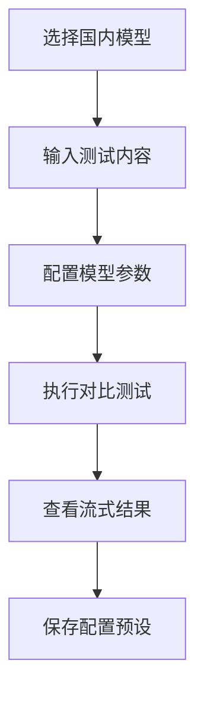
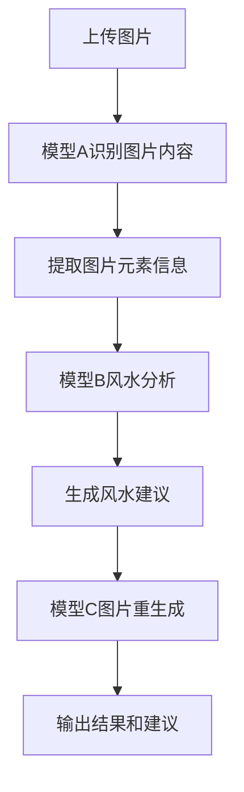

## 1. 产品概述
AI Router项目重构计划，重点优化第二和第三个tab功能，提升用户体验和功能完整性。
- 第二个tab专注国内AI模型适配，主要支持千问和豆包模型
- 第三个tab实现完整的风水图片分析流程，包含图片识别、风水分析和图片重生成

## 2. 核心功能

### 2.1 用户角色
| 角色 | 注册方式 | 核心权限 |
|------|----------|----------|
| 普通用户 | 无需注册 | 使用所有AI模型对比和风水分析功能 |
| 高级用户 | 本地配置 | 自定义模型配置和API密钥管理 |

### 2.2 功能模块
重构后的功能模块包括：
1. **模型对比测试**: 原有的多模型并行对比功能
2. **国内模型专区**: 专门适配千问、豆包等国内模型
3. **风水图片分析**: 三步骤图片处理流程
4. **模型配置管理**: 统一的模型配置和预设管理

### 2.3 页面详情

#### Tab 1 - 模型对比测试 (保持现有功能)
| 页面名称 | 模块名称 | 功能描述 |
|----------|----------|----------|
| 模型对比 | 输入区域 | 输入测试prompt和系统提示词 |
| 模型对比 | 模型选择 | 选择要对比的AI模型提供商 |
| 模型对比 | 结果展示 | 实时显示各模型输出结果和性能指标 |
| 模型对比 | 预设管理 | 保存和加载常用的配置组合 |

#### Tab 2 - 国内模型专区 (重构)
| 页面名称 | 模块名称 | 功能描述 |
|----------|----------|----------|
| 国内模型 | 模型推荐 | 突出显示千问和豆包模型，提供快速选择 |
| 国内模型 | 配置优化 | 针对国内模型优化的参数配置界面 |
| 国内模型 | 流式响应 | 支持实时流式输出显示 |
| 国内模型 | 批量测试 | 支持多个国内模型同时对比测试 |

#### Tab 3 - 风水图片分析 (重构)
| 页面名称 | 模块名称 | 功能描述 |
|----------|----------|----------|
| 风水分析 | 图片上传 | 支持拖拽或选择图片文件上传 |
| 风水分析 | 步骤指示 | 清晰显示当前处理步骤和进度 |
| 风水分析 | 模型A识别 | 自动识别图片中的元素和内容 |
| 风水分析 | 模型B分析 | 基于识别结果提供风水建议 |
| 风水分析 | 模型C生成 | 根据风水建议重新生成优化图片 |
| 风水分析 | 结果展示 | 同时显示风水文字建议和新生成图片 |

## 3. 核心流程

### 3.1 国内模型使用流程

### 3.2 风水图片分析流程

## 4. 用户界面设计

### 4.1 设计规范
- **主色调**: 蓝色系 (#1976d2) 体现科技感
- **辅助色**: 绿色 (#4caf50) 表示成功状态
- **警告色**: 橙色 (#ff9800) 用于重要提示
- **字体**: Roboto，保持Material Design一致性
- **布局**: 卡片式布局，清晰的功能分区

### 4.2 Tab 2 国内模型专区设计
- 顶部突出显示千问和豆包模型的快捷选择按钮
- 参数配置区域采用折叠式设计，默认显示常用选项
- 结果区域支持并排对比显示
- 添加"国内模型推荐"标签和说明文字

### 4.3 Tab 3 风水图片分析设计
- 采用步骤指示器显示当前进度（1.上传 → 2.识别 → 3.分析 → 4.生成）
- 图片上传区域支持拖拽，有清晰的视觉反馈
- 每个步骤的结果都有独立的展示区域
- 最终结果同时展示文字建议和图片，布局美观

### 4.4 响应式设计
- 桌面端优先设计，支持宽屏显示更多对比信息
- 移动端适配，tab切换改为下拉菜单
- 支持触摸操作，图片上传支持移动端相册选择