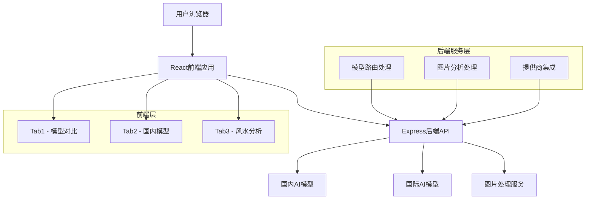
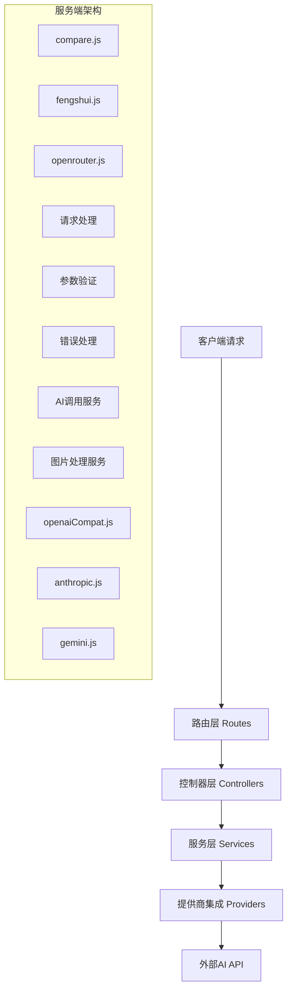

## 1. 架构设计

### 整体架构图


## 2. 技术栈说明

### 前端技术
- **框架**: React 18 + Vite 5
- **UI组件库**: Material-UI (MUI) v6
- **状态管理**: Zustand v4
- **HTTP客户端**: Axios
- **构建工具**: Vite with React plugin

### 后端技术
- **运行时**: Node.js 24
- **Web框架**: Express.js v4
- **日志**: Morgan
- **环境配置**: dotenv
- **文件处理**: Node.js原生fs模块

### AI提供商集成
- **国内模型**: 通义千问、豆包(字节跳动)
- **国际模型**: OpenAI、Anthropic、Google Gemini
- **协议支持**: OpenAI兼容API、Anthropic API、Gemini API

## 3. 路由定义

### API路由配置
| 路由路径 | 请求方法 | 功能描述 |
|----------|----------|----------|
| /api/compare | POST | 多模型对比测试 |
| /api/compare/stream | POST | 流式多模型对比 |
| /api/fengshui/analyze-image | POST | 图片内容识别 |
| /api/fengshui/advise | POST | 风水分析建议 |
| /api/fengshui/generate-ref | POST | 风水图片重生成 |
| /api/openrouter/models | GET | 获取OpenRouter模型列表 |
| /api/upload | POST | 图片文件上传 |

### 前端路由
采用单页应用(SPA)设计，通过tab切换实现不同功能模块的展示。

## 4. 数据模型定义

### 提供商配置模型
```typescript
interface ProviderConfig {
  id: string;
  name: string;
  enabled: boolean;
  type: 'openai-compat' | 'anthropic' | 'gemini';
  params: {
    baseURL: string;
    model: string;
    apiKey: string;
    temperature: number;
    top_p: number;
    max_tokens: number;
    system?: string;
  };
}
```

### 对比测试结果模型
```typescript
interface CompareResult {
  id: string;
  name: string;
  ok: boolean;
  output?: string;
  error?: string;
  usage?: {
    prompt_tokens: number;
    completion_tokens: number;
    total_tokens: number;
  };
  timings: {
    start: number;
    end: number;
    durationMs: number;
  };
}
```

### 风水分析流程模型
```typescript
interface FengshuiAnalysis {
  step: 'upload' | 'recognize' | 'analyze' | 'generate' | 'complete';
  originalImage?: string;
  recognizedContent?: string;
  fengshuiAdvice?: string;
  generatedImage?: string;
  error?: string;
}
```

## 5. 服务端架构

### 服务端层次结构


## 6. 数据库设计
本项目采用轻量级设计，使用本地文件存储和浏览器本地存储：

### 本地存储方案
- **配置存储**: 浏览器localStorage存储用户配置和预设
- **文件存储**: 服务器本地文件系统存储上传图片
- **会话数据**: 内存中临时存储处理状态

### 数据持久化
```typescript
// 预设配置存储
const PRESETS_KEY = 'airooter_presets';
const PROVIDERS_KEY = 'airooter_providers';

// 文件上传存储路径
const uploadsPath = path.join(__dirname, 'uploads');
```

## 7. 关键技术实现

### 国内模型适配
- **通义千问**: 使用阿里云DashScope兼容API
- **豆包**: 使用字节跳动Volces引擎API
- **优化策略**: 针对中文语境和响应速度进行参数调优

### 多模态图片处理
```typescript
// 图片识别处理流程
const contentParts = [
  { type: 'image_url', image_url: { url: imageUrl } },
  { type: 'text', text: recognitionPrompt }
];

// 风水分析prompt模板
const fengshuiPrompt = `基于以下图片识别结果，提供风水分析和建议：
${recognizedContent}

请按JSON格式输出：{advice:[string], itemsToAdd:[{item,reason,area,direction,style,color,size,material}]}`;
```

### 流式响应处理
- 使用Server-Sent Events (SSE) 实现实时响应
- 支持多提供商同时流式输出
- 客户端实时展示处理进度和结果

## 8. 性能优化

### 前端优化
- 组件懒加载，减少初始bundle大小
- 虚拟滚动展示大量对比结果
- 图片懒加载和压缩处理

### 后端优化
- 并发请求处理，并行调用多个AI API
- 连接池管理，复用HTTP连接
- 错误重试机制，提高成功率

### 缓存策略
- 浏览器本地存储配置信息
- 服务端内存缓存常用模型列表
- CDN加速静态资源加载

## 9. 安全考虑

### API安全
- 环境变量存储敏感API密钥
- 请求频率限制和防刷机制
- 输入验证和SQL注入防护

### 文件安全
- 图片文件类型验证
- 文件大小限制(20MB)
- 安全的路径处理和访问控制

## 10. 部署方案

### 开发环境
```bash
npm run dev  # 同时启动前端和后端开发服务器
```

### 生产环境
```bash
npm run build  # 构建前端静态资源
npm run preview  # 启动生产服务器
```

### 部署要求
- Node.js 18+ 环境
- 至少2GB内存用于AI模型调用
- 稳定的网络连接访问外部AI API