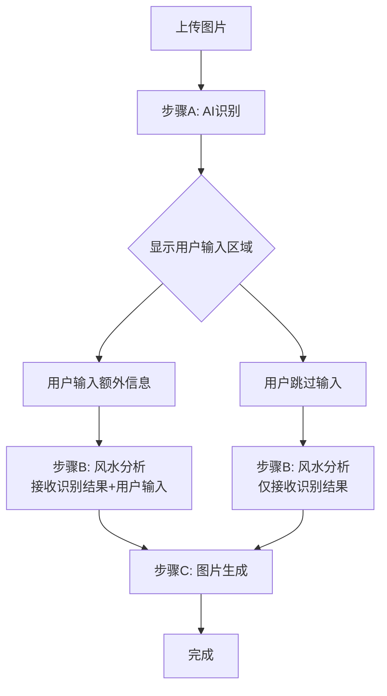

## 1. 产品概述
在风水分析流程中，在步骤A（图片识别）和步骤B（风水分析）之间添加一个可选的用户输入环节。用户可以输入额外信息来增强风水分析的个性化程度，如果不输入则保持原有流程不变。

这个新功能旨在让用户能够提供更多背景信息（如房间用途、个人需求、特殊关注点等），从而获得更精准的风水建议。

## 2. 核心功能

### 2.1 用户角色
| 角色 | 注册方式 | 核心权限 |
|------|----------|----------|
| 普通用户 | 无需注册 | 可使用所有基础功能，包括新的可选输入环节 |

### 2.2 功能模块
风水分析流程增强功能包含以下主要模块：
1. **步骤A增强**：图片识别完成后显示用户输入区域
2. **用户输入区域**：可选的文本输入框，支持多行输入
3. **步骤B增强**：接收并处理用户输入和图片识别结果
4. **流程控制**：智能判断用户是否输入内容，决定后续处理逻辑

### 2.3 页面详情
| 页面名称 | 模块名称 | 功能描述 |
|----------|----------|----------|
| 风水分析页面 | 步骤A完成区域 | 显示图片识别结果，新增"下一步"按钮 |
| 风水分析页面 | 用户输入区域 | 可选的多行文本输入框，提示用户输入额外信息 |
| 风水分析页面 | 步骤B触发区域 | 根据用户输入情况，智能传递参数给后端 |
| 风水分析页面 | 流程状态指示 | 更新步骤指示器，显示当前进行到的步骤 |

## 3. 核心流程

### 原有流程 vs 新流程
**原有流程**：步骤A → 步骤B → 步骤C
**新流程**：步骤A → 用户输入（可选）→ 步骤B → 步骤C

### 详细流程说明
1. **步骤A完成**：用户上传图片并完成识别
2. **显示用户输入区域**：在步骤A结果下方显示可选输入框
3. **用户选择**：
   - 输入额外信息 → 将用户输入+识别结果一起传给步骤B
   - 不输入直接继续 → 仅将识别结果传给步骤B
4. **步骤B处理**：后端接收参数并根据是否有用户输入调整分析逻辑
5. **继续后续步骤**：保持原有步骤C流程不变

### 页面导航流程图


## 4. 用户界面设计

### 4.1 设计风格
- **整体风格**：保持现有Material Design风格
- **颜色方案**：继续使用蓝色主色调，输入框使用标准文本框样式
- **布局风格**：卡片式布局，输入区域与步骤A结果区域视觉上分离但逻辑上关联
- **交互反馈**：输入框获得焦点时显示蓝色边框，提供清晰的视觉提示

### 4.2 页面设计概述
| 页面名称 | 模块名称 | UI元素 |
|----------|----------|--------|
| 风水分析页面 | 用户输入区域 | 多行文本输入框(3-4行)，占位符文本"可选：输入房间用途、个人需求或其他相关信息..."，底部显示"此步骤为可选，可直接点击继续"提示 |
| 风水分析页面 | 控制按钮区域 | "继续"按钮（主要操作），"跳过"链接（次要操作），按钮状态根据输入内容动态调整 |
| 风水分析页面 | 步骤指示器 | 更新步骤标题为"补充信息"，在步骤A和B之间添加新步骤 |

### 4.3 响应式设计
- **桌面端**：输入框宽度为容器的100%，与步骤A结果区域并排或上下布局
- **移动端**：输入框自动适应屏幕宽度，保持可用性
- **触摸优化**：输入区域足够大，便于触摸操作

## 5. 技术实现要点

### 5.1 前端实现
- 在`FengshuiAnalysisTab.jsx`中添加新的状态变量管理用户输入
- 更新步骤指示器，添加新的步骤状态
- 修改`runStepB`函数，支持接收用户输入参数
- 添加输入验证和字符长度限制（建议500字符以内）

### 5.2 后端实现
- 更新`/api/fengshui/advise`接口，支持接收可选的`userInput`参数
- 修改提示词逻辑，当存在用户输入时将其纳入分析考量
- 保持向后兼容性，确保不传入用户输入时功能正常

### 5.3 API变更
```javascript
// 新的请求体格式
{
  imageElements: {...},      // 原有的图片识别结果
  userInput: "string",       // 新增：可选的用户输入
  system: "string",          // 系统提示词
  prompt: "string",          // 用户提示词
  provider: {...}            // 提供商配置
}
```

## 6. 用户体验优化

### 6.1 交互细节
- **输入提示**：提供具体的输入示例，如"卧室朝南，希望改善睡眠质量"
- **字符计数**：显示当前输入字符数，限制在合理范围内
- **自动保存**：本地保存用户输入，防止意外刷新丢失
- **键盘友好**：支持Tab键切换，Enter键继续操作

### 6.2 性能考虑
- **延迟加载**：用户输入区域在步骤A完成后才渲染
- **防抖处理**：对输入内容进行防抖，避免频繁的状态更新
- **内存管理**：及时清理不需要的输入内容，避免内存泄漏

## 7. 测试场景

### 7.1 功能测试
1. **正常流程**：输入有效内容，验证步骤B能正确接收和处理
2. **跳过流程**：不输入内容，验证步骤B按原有逻辑执行
3. **边界测试**：输入超长文本、特殊字符等边界情况
4. **兼容性测试**：确保不影响原有功能的正常使用

### 7.2 用户体验测试
1. **界面测试**：验证输入区域显示正常，响应式布局正确
2. **交互测试**：测试键盘导航、按钮状态变化等交互细节
3. **性能测试**：验证输入响应及时，无卡顿现象