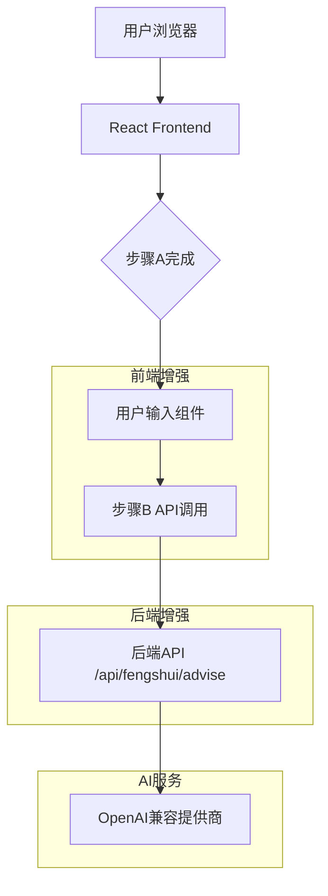

## 1. 架构设计

### 系统架构图


## 2. 技术栈
- **前端**: React@18 + Material-UI@5 + Vite
- **后端**: Node.js + Express（集成在Vite中）
- **数据库**: 无（保持现有架构）
- **状态管理**: React useState + useContext
- **UI组件**: Material-UI组件库

## 3. 路由定义
| 路由 | 用途 |
|------|------|
| /api/fengshui/advise | 风水分析接口（增强版，支持userInput参数） |

## 4. API定义

### 4.1 增强的风水分析API
```
POST /api/fengshui/advise
```

请求体：
| 参数名 | 参数类型 | 是否必需 | 描述 |
|--------|----------|----------|------|
| imageElements | object/string | 是 | 图片识别结果 |
| userInput | string | 否 | 用户额外输入信息 |
| system | string | 否 | 系统提示词 |
| prompt | string | 否 | 用户提示词 |
| provider | object | 是 | AI提供商配置 |

响应：
| 参数名 | 参数类型 | 描述 |
|--------|----------|------|
| output | string | 风水分析结果 |
| debug | object | 调试信息（可选） |

示例请求：
```json
{
  "imageElements": {
    "roomType": "卧室",
    "direction": "朝南",
    "objects": [...]
  },
  "userInput": "这个房间主要用作书房，希望提升学习效率",
  "system": "你是专业风水顾问...",
  "provider": {
    "id": "doubao",
    "name": "豆包",
    "type": "openai-compat"
  }
}
```

## 5. 数据模型

### 5.1 前端状态管理
```javascript
// 新增状态变量
const [userInput, setUserInput] = useState('')
const [showUserInput, setShowUserInput] = useState(false)
const [userInputStep, setUserInputStep] = useState(false)
```

### 5.2 步骤状态管理
```javascript
// 更新步骤定义
const STEPS = [
  '上传图片',
  'AI识别内容', 
  '补充信息（可选）',
  '风水分析',
  '生成建议图'
]
```

## 6. 组件设计

### 6.1 用户输入组件
```javascript
const UserInputStep = ({ 
  userInput, 
  setUserInput, 
  onContinue, 
  onSkip 
}) => {
  return (
    <Card variant="outlined" sx={{ mb: 2 }}>
      <CardContent>
        <Typography variant="subtitle1" gutterBottom>
          步骤 2.5：补充信息（可选）
        </Typography>
        <TextField
          fullWidth
          multiline
          rows={4}
          label="可选：输入房间用途、个人需求或其他相关信息"
          value={userInput}
          onChange={(e) => setUserInput(e.target.value)}
          placeholder="例如：这个房间主要用作书房，希望提升学习效率"
          helperText="此步骤为可选，可直接点击继续"
          inputProps={{ maxLength: 500 }}
        />
        <Stack direction="row" spacing={2} sx={{ mt: 2 }}>
          <Button 
            variant="contained" 
            onClick={onContinue}
            disabled={userInput.length > 500}
          >
            继续
          </Button>
          <Button 
            variant="text" 
            onClick={onSkip}
          >
            跳过
          </Button>
        </Stack>
      </CardContent>
    </Card>
  )
}
```

## 7. 核心逻辑实现

### 7.1 步骤控制逻辑
```javascript
// 修改后的步骤控制
const handleStepAComplete = (result) => {
  setRecognizedContent(result)
  setActiveStep(2) // 显示用户输入步骤
  setShowUserInput(true)
}

const handleUserInputContinue = () => {
  setActiveStep(3) // 进入步骤B
  setUserInputStep(true)
  runStepB(userInput) // 传递用户输入
}

const handleUserInputSkip = () => {
  setActiveStep(3) // 直接进入步骤B
  setUserInputStep(true)
  runStepB(null) // 不传递用户输入
}
```

### 7.2 步骤B函数增强
```javascript
const runStepB = async (userInputOverride = null) => {
  const imageElements = recognizedContent
  const finalUserInput = userInputOverride !== null ? userInputOverride : userInput
  
  const requestBody = {
    imageElements,
    userInput: finalUserInput, // 新增参数
    system: systemPromptB,
    prompt: promptB,
    provider: providerConfig
  }
  
  // 原有的API调用逻辑...
}
```

## 8. 后端处理逻辑

### 8.1 提示词构建增强
```javascript
// 在 adviseFengshui 函数中
const { imageElements, userInput, system, prompt: promptOverride } = req.body || {}

// 构建增强的提示词
let enhancedPrompt = promptOverride || ''
if (userInput && userInput.trim()) {
  enhancedPrompt = `用户额外信息：${userInput}\n\n${enhancedPrompt}`
}

// 确保包含图片元素信息
const finalPrompt = `输入元素：\n${typeof imageElements==='string'?imageElements:JSON.stringify(imageElements)}\n\n${enhancedPrompt}`
```

## 9. 性能优化

### 9.1 前端优化
- **防抖处理**：对用户输入使用防抖，避免频繁的状态更新
- **懒加载**：用户输入组件在需要时才渲染
- **内存管理**：及时清理不需要的状态数据

### 9.2 后端优化
- **输入验证**：对用户输入进行长度和格式验证
- **错误处理**：完善的错误处理和用户友好的错误提示
- **缓存策略**：保持现有的缓存机制不变

## 10. 兼容性考虑

### 10.1 向后兼容
- API接口保持向后兼容，不传入userInput时功能不变
- 前端UI可以选择性显示新功能
- 数据库结构无需变更

### 10.2 浏览器兼容
- 保持与现有浏览器支持一致
- 使用标准的HTML5和ES6+特性
- Material-UI组件保证跨浏览器一致性